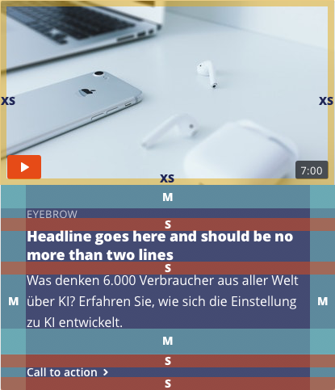
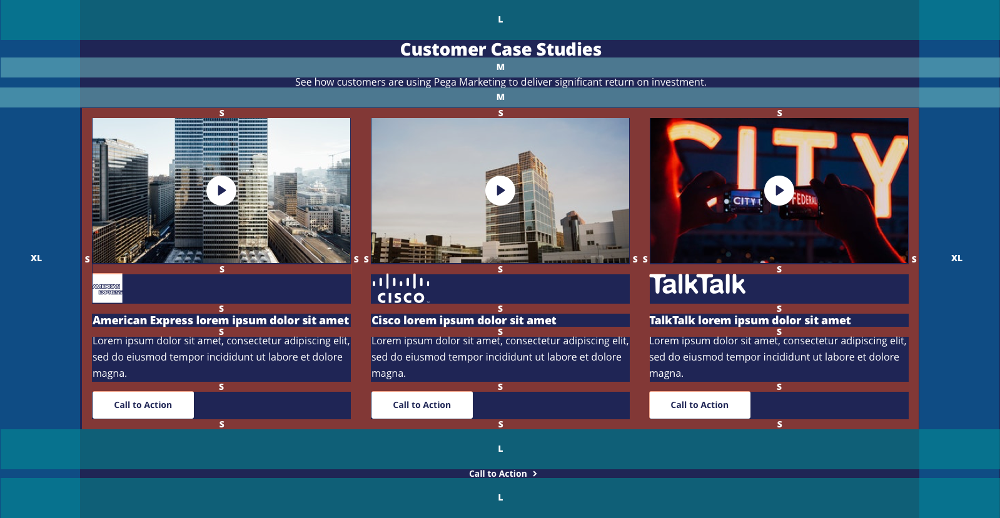

We use spacing tokens to make margins and patterns consistently across components and layouts. Using a set spacing scale helps eliminate guesswork regarding the space between elements, and helps create a smooth, readable flow from page to page.

## Best Practices

Human beings are pattern seekers. An important part of how we perceive our environments is by grouping together things that appear related, as a way to reduce our cognitive load. Here are a few key guidelines to consider when using spacing:

### Optimize for pattern recognition.

Pay attention to the [proximity](https://www.smashingmagazine.com/2014/05/design-principles-space-figure-ground-relationship/) between items. Use `small` spacing between elements that belong together; use `medium` or `large` spacing to distinguish an item from the rest of the group.

### Use backgrounds thoughtfully.

Putting a background behind a set of items helps to create a [figure/ground relationship](https://www.smashingmagazine.com/2014/05/design-principles-space-figure-ground-relationship/) that can make it easier to scan a page. Too many backgrounds, however, makes it harder to scan the information. Use `large` or `xlarge` spacing at the edge of backgrounds to help contain the different chunks of information.

## Scale

Use the Spacing Scale when creating individual elements, or doing page layouts in Sketch. Our spacing scale is already applied to and used within all Bolt components. 

| **Name (use** `**bolt-spacing(NAME)**` **to apply class)** | **rem** | **px** | **Example**                                             |
| ---------------------------------------------------------- | ------- | ------ | ------------------------------------------------------- |
| xxsmall                                                    | .25     | 4      |  |
| xsmall                                                     | .5      | 8      |    |
| small                                                      | 1       | 16     |      |
| medium                                                     | 2       | 32     |    |
| large                                                      | 4       | 64     |      |
| xlarge                                                     | 8       | 128    |    |
| xxlarge                                                    | 16      | 256    |  |

## Examples

Here are a few representative examples of how to use spacing in your layouts.

### Card with teaser

In a teaser card, use `small` spacing to separate text elements from one another. `medium` spacing provides breathing room around the main content components.

### Hero bands

In a hero/feature band, use `medium` spacing to create visual distinction between elements in each section, and incorporate `xlarge` spacing around the sections to help provide breathing room for the image.

### Multi-card bands

When using a band to hold multiple things, including headlines, cards and other elements, be judicious with spacing around each element to ensure that the eye can move through the section easily. 

