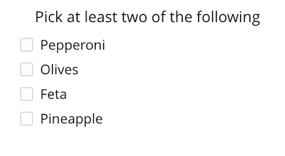
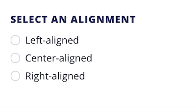

Forms are used to submit data to the system. Common examples include event or site registration, contact forms, or search interfaces. 

## Best practices

An effective form is easy to understand and fill out, doesn’t ask for more information than needed, and makes it clear what the next action is. In addition to these considerations, follow the guidelines below to successfully create forms:

### Use the right element for the job

Checkboxes should be used if someone can select multiple options from a list. If the list has more than 7 options, use a multi-select drop-down instead. Radio buttons are used when only one option can be chosen from a list. If the list has only 2 options, use a toggle instead. 

### Help people diagnose and recover from errors

Keep error messages specific, concise, and adjacent to the field they pertain to. Provide adequate helper text and field labels to make the purpose and guidelines for form elements clear. When writing error messages, maintain a polite and helpful tone. Never blame the user for an error.

### Don’t ask for more info than you need

When designing a form, aim to be as concise as possible. Ensure that each piece of information you are asking for is either necessary to qualify a lead or to complete the task successfully. Removing unnecessary fields is [one way to increase conversions](https://conversionxl.com/blog/reduce-form-fields/). 

## Form Elements

All form elements include a Dark Blue focus state, usually as a 1px outline, along with a slight drop shadow. When inputting text, the label appears at the top of the form field to provide context. Some other helpful considerations: 

- label text should be short, direct and in sentence case
- avoid colons at the end of labels
- labels should be associated with form fields using the `for` attribute
- if you do ask for optional information, mark the labels of optional fields with ‘(optional)’
- don’t mark mandatory fields with asterisks

### Text inputs

Use a text input for a single line of text that doesn’t require formatting. Input data displays as plain text. Example uses include asking for names or inputting the title of a post.

### Textareas

Use a textarea for longer passages of text, such as blog posts, descriptions or comments. Textareas generally support WYSIWYG editors, in-line images and standard formatting such as bold or italic text.

### Checkboxes and Radio buttons

Use checkboxes and radio buttons to allow people to select from a predetermined list. If more than 7 items exist in the list, use a Select element instead. 

### Select Lists

Use a select list whenever you have a list longer than 7 items to choose from. Bolt does not currently support multi-select lists.

## Disabled states

When disabled, form fields take on the `xlight` color as their background and lose the ability to interact with it.

## Validation

Effective form validation is critical to helping people identify and recover from errors. As a general best practice, we recommend validating text fields prior to form submission, after the user leaves the field. Error messages should appear inline with the field, to call attention to what needs to be fixed.

When writing error messages and other interface copy, focus on being concise, clear, and grammatically correct. Avoid jargon and abbreviations wherever possible, and never blame the user for the error. 

A good error message gives someone an immediate sense of what the problem is, followed by concise instruction on how to correct it. See the examples below for guidelines: 

| **Good**                                                         | **Bad**                                                           |
| ---------------------------------------------------------------- | ----------------------------------------------------------------- |
| The username you entered is already taken.                       | Username already exists                                           |
| That doesn’t appear to be a valid email address.                 | You entered an invalid email address.                             |
| Those passwords don’t match.                                     | Passwords must match                                              |
| We can't find that email/password combination. Please try again. | You have either been locked out, or your credentials don’t match. |

