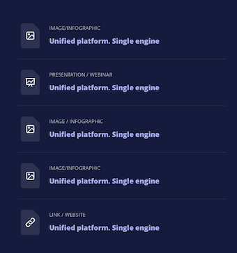
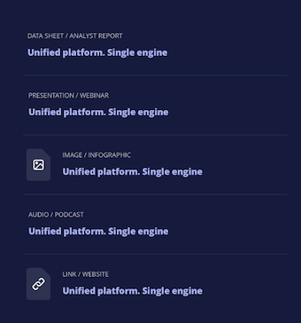
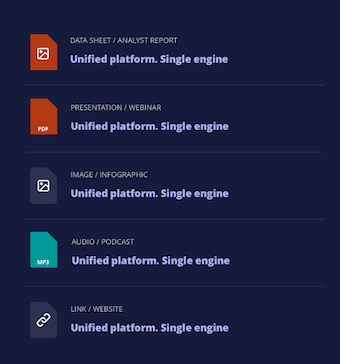

Iconography uses images and symbols to represent a concept visually. In a very small space, icons must convey meaning that helps people clearly understand functionality, status, or category. In Bolt, we use icons to provide clarity and reduce [cognitive load](https://en.wikipedia.org/wiki/Cognitive_load) on users.

## Best Practices

Bolt icons are designed to be simple and informative. Used carefully, they add visual interest to a design while increasing understandability. Used incorrectly, they clutter and confuse your layouts. Here are Bolt’s guiding principles for using icons:

### Use icons in conjunction with text.

Icons aren’t ornamental. They should bring clarity to a subject, or indicate important actions or sections. Icons are at their strongest when combined with text. Whenever an icon is used, it should be used in conjunction with a label or title. Exceptions to this rule are navigation icons such as the magnifying glass (Search) or hamburger (Menu).

### Prioritize recognition over recall.

Most icons within Bolt have been designed for a specific use. Using multiple icons to represent the same concept not only increases cognitive load, but dilutes the efficacy of the icon and the relationship between the icon and the idea.

### Create visual consistency.

Icons should be consistent in layouts, not only in their look and feel but in their placement within a page or component.

## Icon Usage

Below are some common ways that we use icons throughout Pega's Digital ecosystem.

### When to use icons

Icons are powerful visual helpers, and should be used with care. Overuse quickly results in UIs that are visually overwhelming or distracting.
Icons are commonly used:

- In banners or notifications to bring attention to a specific theme (system warnings, errors, etc.)
- Inline with text to add clarity
- To create affordance for something a user can take action on, or which results in an action
- As a way to distinguish items among a set (e.g. a list of different file types or product names)

### Icon types

Bolt contains two types of icons: content icons and utility icons. Content icons bring clarity to a topic, providing recognition over recall, e.g. representing a specific product or platform concept. Utility icons represent an action someone can take, like closing a window or downloading a file.

### Color 

Interactive UI icons need to pass the same color contrast ratio as typography at a 4.5:1 ratio. UI icons are always a solid color. The color of the icon should depend on the importance of the icon's action.

By default, icons take on the primary headline color for the background theme. 

If actionable, icons take on a specific override color based on the theme that adds affordance.

### Do: Use icons to convey meaning or distinguish among a set
   

### Don’t: Use icons inconsistently
   

